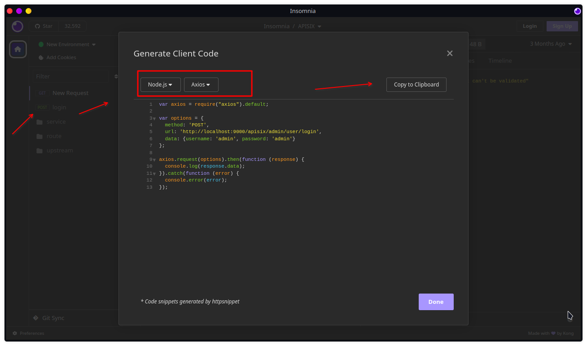

# Http axios

This extension provides 1 tasks!

* `AxiosRequest`

## Features

* Http Requests with `Axios`.


## Usage sample

Build your Request from `Insomnia` or `Postman` and send via `source` input.

> ⚠️ **We do not evaluate this javascript snippet code**, just get the `config` request data.




```yaml
- job:
  ...
  steps:
  - task: AxiosRequest@4
    displayName: "Axios Request from Insomnia"
    inputs:
      source: |
        ...
        var axios = require("axios").default;

        var options = {
          method: 'POST',
          url: 'http://localhost:9000/apisix/admin/user/login',
          data: {username: 'admin', password: 'admin'}
        };

        axios.request(options).then(function (response) {
          console.log(response.data);
        }).catch(function (error) {
          console.error(error);
        });
        ...

  - task: AxiosRequest@4
    displayName: "Axios Request from Postman"
    inputs:
      source: |
        ...
        let config = {
          method: 'GET',
          url: 'http://localhost:7007/api/catalog/entities',
          params: {filter: ['kind=api', 'relations']},
          headers: {'User-Agent': 'insomnia/2023.5.8'}
        };
        ...


```

## Help us

See [CONTRIBUTING.md](https://github.com/alelltech/azdo-http-axios/blob/main/CONTRIBUTING.md)


